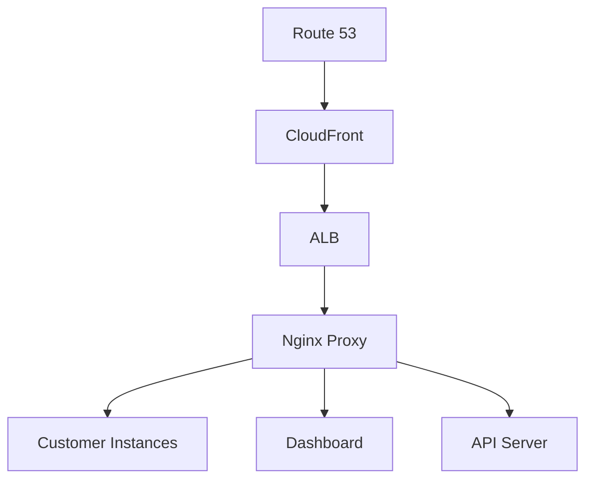

# システム構成

## ドメイン構成

### メインサービスサイト (www.teai.io)
```
www.teai.io/
├── / (ホーム)
│   ├── 特徴・機能説明
│   ├── 料金プラン
│   └── 事例・導入企業
├── /features (機能詳細)
├── /pricing (料金プラン)
├── /docs (ドキュメント)
├── /blog (ブログ・ニュース)
└── /contact (問い合わせ)
```

### 顧客向けサービス
- *.teai.io: 顧客のOpenHandsインスタンス
- dashboard.teai.io: 管理画面
- api.teai.io: API

## インフラストラクチャ

### AWS構成


### セキュリティ構成
- SSL/TLS (Let's Encrypt)
- WAF
- セキュリティグループ
- VPCネットワーク分離

## コンポーネント構成

### フロントエンド
- フレームワーク: Next.js
- スタイリング: Tailwind CSS
- 状態管理: Zustand
- フォーム: React Hook Form

### バックエンド
- フレームワーク: NestJS
- データベース: PostgreSQL
- キャッシュ: Redis
- メッセージキュー: SQS

### インフラ
- コンテナ: Docker
- オーケストレーション: ECS
- CI/CD: GitHub Actions
- モニタリング: CloudWatch

## ストレージ構成

### データベース
- メインDB: Amazon RDS (PostgreSQL)
- セッション管理: Amazon ElastiCache (Redis)
- ログ保存: Amazon S3

### バックアップ
- DBバックアップ: 自動スナップショット (毎日)
- インスタンスバックアップ: AMIバックアップ (週次)
- 設定バックアップ: S3 (リアルタイム)

## 監視構成

### メトリクス
- インスタンス状態
- リソース使用率
- アプリケーションパフォーマンス
- エラーレート

### アラート
- リソース枯渇
- エラー頻発
- セキュリティイベント
- バックアップ失敗

### ログ管理
- アプリケーションログ
- アクセスログ
- セキュリティログ
- 監査ログ

## 料金プラン構成

> **注意: 以下は旧価格(アーカイブ)。現行価格は Starter ¥1,480 / Pro ¥4,350 / Business ¥14,800/月 (USD: Starter $29 / Pro $99)。現行課金実体は nanobot (Rust): `nanobot/crates/teai-core/src/service/stripe.rs`**

### 基本プラン
1. Free Tier (開発者向け)
   - ¥0/月
   - 1インスタンス（t3.micro）
   - 5GB ストレージ
   - 12時間/日の稼働制限

2. Startup Plan
   - ¥19,800/月
   - t3.small × 2インスタンス
   - 30GB ストレージ
   - GitHub連携機能

3. Growth Plan
   - ¥49,800/月
   - t3.large × 3インスタンス
   - 100GB ストレージ
   - AI機能付き

4. Scale Plan
   - ¥148,000/月
   - カスタマイズ可能
   - エンタープライズ機能

### オプション料金
- 追加ストレージ: ¥1,000/10GB
- バックアップ増設: ¥5,000/追加セット
- 追加APIコール: ¥5,000/10万リクエスト

## 認証・認可構成

### ユーザー認証
- JWT認証
- OAuth2.0対応
- MFA対応

### 権限管理
- RBACモデル
- カスタムロール
- 監査ログ

## 将来の拡張性

### スケーリング
- マルチリージョン対応
- オートスケーリング
- 負荷分散

### 新機能
- AI機能強化
- WebSocket対応
- カスタムドメイン対応